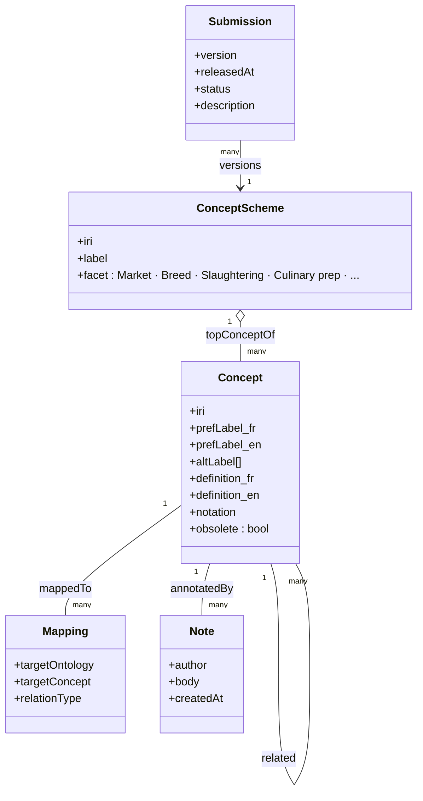
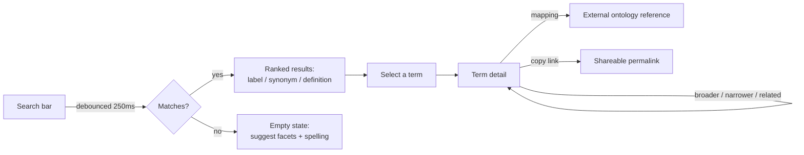
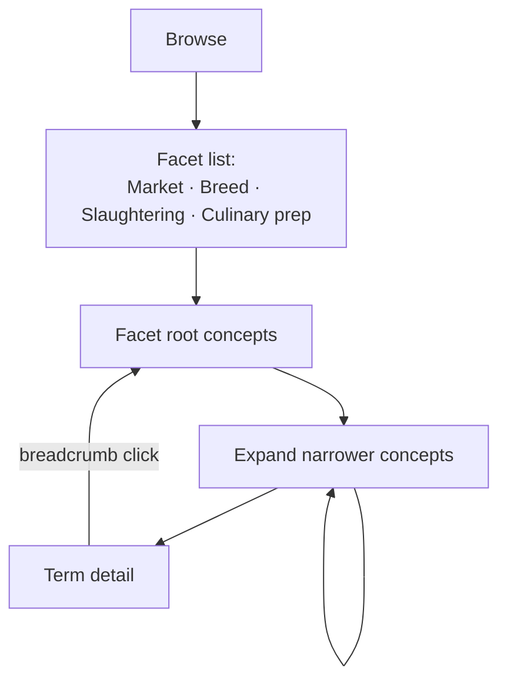
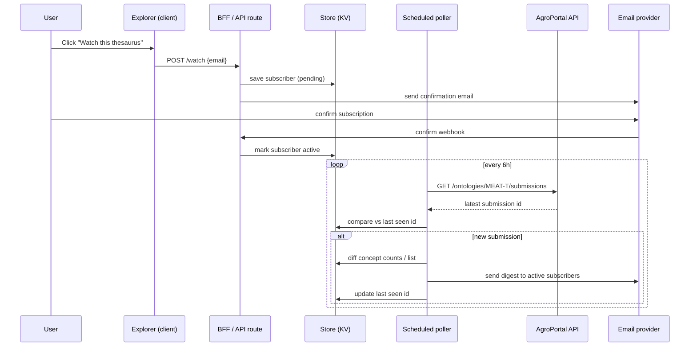
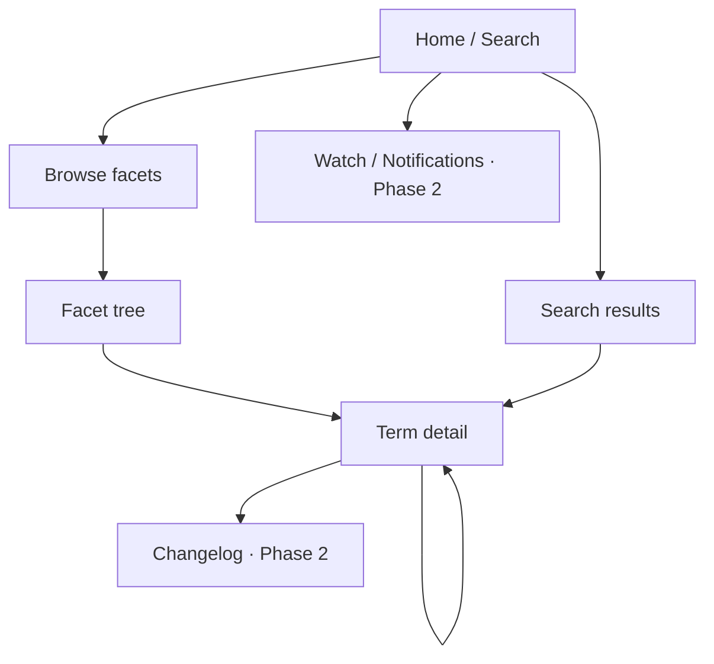
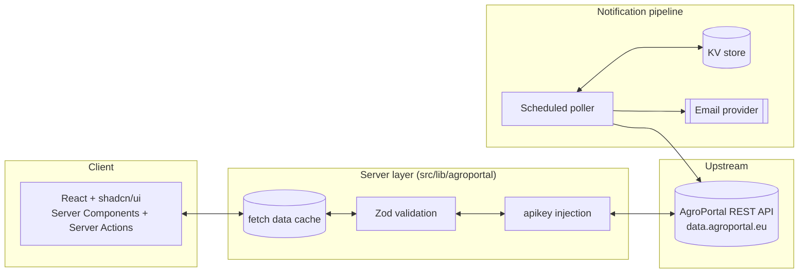

# Meat Thesaurus Explorer — Build Plan

A bilingual (FR/EN) reference tool for the meat production vocabulary — market, breed, slaughtering, culinary preparation, and more — built on top of AgroPortal's **MEAT-T** ontology (derived from the *Dictionnaire de la viande*, Académie de la viande, France).

- **Public cible:** professionnels et étudiants de la filière viande
- **Primary color:** clinical green
- **Languages:** FR / EN
- **Source:** `data.agroportal.eu` (AgroPortal / OntoPortal REST API — `data.agroportal.lirmm.fr` still works but 302-redirects here)
- **Read/write:** read-only — no editing or proposing changes to the ontology

> **Status:** Phase 0 is done. The data layer (§3, §8) is implemented in `src/lib/agroportal` (called directly by Server Components) + `src/lib/actions.ts` (Server Actions for the 2 client-interactive surfaces — no REST route handlers, see §3 "Implementation") and has been exercised against the live upstream with a real API key. Findings below are corrected from live testing, not inferred from the docs.

---

## 1 — Overview

AgroPortal's own browser (`agroportal.eu/ontologies/MEAT-T`) is built for ontology engineers: SKOS jargon, dense metadata panels, RDF serialization pickers. It's the right tool for curators, the wrong one for a slaughterhouse quality manager looking up *"maturation"* before a client meeting, or a student comparing French and English carcass grading terms.

The Explorer strips that down to three verbs — **search**, **browse**, **read** — plus one thing AgroPortal doesn't offer well: a branded way to **get notified** when the thesaurus changes.

> **Governing principle:** the data model dictates the app. MEAT-T is a SKOS thesaurus — concepts, hierarchical relations, cross-references, per-language labels, versioned submissions. Each of those primitives maps to exactly one piece of the product (see §6, Information architecture), rather than inventing a UI shape unrelated to how the data is actually structured.

---

## 2 — Domain & data model

MEAT-T is published as a SKOS thesaurus (confirmed via the ontology browser: concepts, schemes, mappings, and notes tabs). Every screen in the Explorer is a view over one of these five shapes.



Five primitives, five UI surfaces: `ConceptScheme` → facet browse, `Concept` → term card, broader/narrower → hierarchy tree, `Mapping` → related-terms rail, `Submission` → changelog & notifications.

**Confirmed live** via `GET /ontologies/MEAT-T/classes/roots` — MEAT-T is a single flat `ConceptScheme` (`http://opendata.inrae.fr/ThViande/MeatThesaurus`) with exactly **12 top concepts**, so "Browse" is a flat facet list, not a nested scheme picker:

| FR | EN | IRI |
|---|---|---|
| élevage | livestock production | `.../C1013` |
| découpe | cutting | `.../C1110` |
| gibier | game | `.../C1351` |
| métiers de la filière viande | meat professions | `.../C1359` |
| politique sanitaire | health policy | `.../C1360` |
| préparations culinaires des viandes | culinary preparation of meats | `.../C1361` |
| organisations de la profession | professional organizations | `.../C1362` |
| marché et commercialisation du bétail et de la viande | meat market | `.../C1363` |
| abattage | *(slaughtering)* | — |
| viande | *(meat)* | — |
| animal de boucherie | *(livestock/butchery animal)* | — |
| race | breed | — |

(IRIs share the `http://opendata.inrae.fr/ThViande/` prefix.)

---

## 3 — API integration layer

AgroPortal runs the OntoPortal/BioPortal appliance, so its REST API follows that family's conventions: JSON-LD collections, `page`/`pagesize` pagination, and a `links` block on every resource for hierarchy navigation without hand-building URLs.

| Endpoint | Purpose | Powers |
|---|---|---|
| `GET /ontologies/MEAT-T` | Latest submission metadata (name, description, contact, homepage) | About panel, attribution |
| `GET /ontologies/MEAT-T/submissions` | Full version history: `released`, `status`, `description` | Changelog, notifications |
| `GET /ontologies/MEAT-T/classes/roots` | Top concepts | Facet browse entry points |
| `GET /ontologies/MEAT-T/classes/{id}` | Single concept, `{id}` = URL-encoded IRI | Term detail |
| `GET .../classes/{id}/children` · `/parents` · `/tree` | Hierarchy traversal | Tree nav, breadcrumb |
| `GET .../classes/{id}/mappings` | Cross-ontology equivalents | Related-terms rail |
| `GET /search?q=&ontologies=MEAT-T` | Ranked full-text search across labels + definitions | Global search |
| `GET /ontologies/MEAT-T/properties` | Relation/property vocabulary used | Internal typing only |
| `GET /ontologies/MEAT-T/notes` | Public community annotations | Read-only "notes" panel |

**Auth & key handling** — requests need `Authorization: apikey token=<key>`. The key is requested via a free AgroPortal account and **never shipped to the browser** — it lives only in the BFF layer (§8, now implemented — see below), which also gives us a single point to enforce caching and absorb upstream rate limits.

**Multilingual labels — confirmed live.** MEAT-T is *not* SKOS-XL (the `skos_xl_labels` endpoint returns an empty collection for this ontology) and `display_language` / `Accept-Language` have no effect. The actual switch is a plain query parameter: **`?lang=fr`** (alias `language=fr`), applied per-request to `/classes/{id}`, `/classes/roots`, `/classes/{id}/children`, `/classes/{id}/parents`, and `/search`. Without it, everything defaults to English. Verified round-trip on a real term: `lang=fr` on `breed` (`http://opendata.inrae.fr/ThViande/C853`) returns `prefLabel: "race"` and a fully French definition, not just a translated label.

**Caching** — a thesaurus changes on the order of one submission per months, not per minute. Cache class/tree responses aggressively (hours–a day), search for less long since its key space is unbounded. Implemented via Next.js's fetch data cache (`next: { revalidate }`), see `CACHE_SECONDS` in `src/lib/agroportal/client.ts`.

### Implementation

**Revised from the original plan**: no REST route handlers. This app has exactly one consumer of its own data layer — itself — so a `/api/*` REST surface was pure ceremony (duplicate query-param validation, URL construction, fetch/JSON parsing on both sides of a round trip that never leaves the server). Server Components call the service layer directly; the two Client Components that need server data (search-as-you-type, lazy tree expansion) call Server Actions instead. Layout:

```
src/lib/agroportal/
  client.ts     # low-level fetch: base URL, apikey header, timeout+retry, cache hints
  errors.ts     # AgroPortalError — one shape for timeout / network / 4xx / 5xx / bad JSON
  schemas.ts    # zod schemas — validate only the fields this app reads, not the full payload
  types.ts      # our own DTOs: Facet, TermSummary, TermDetail, MappingRef, SearchResult
  normalize.ts  # raw AgroPortal shape -> our DTOs
  service.ts    # getFacets, getTerm, getChildren, searchTerms — called directly by pages
src/lib/actions.ts  # "use server" — searchAction, getChildrenAction, for the 2 client-interactive surfaces
```

`getTerm()` fans one call out into four parallel upstream calls (detail, parents, children, mappings) and returns one normalized object via `Promise.allSettled` — `detail` fails loudly (no term page without it), the other three degrade to empty rather than taking the whole page down over one slow secondary call (AgroPortal measured slower under its own concurrency: ~5s per call alone, ~10s when these four run together).

Not yet built: the `notes` endpoint (MEAT-T returns 0 notes on every term probed so far — low priority), and the submissions/changelog endpoint (Phase 3, §9–10).

---

## 4 — Features

### MVP

- **Global search** — debounced, bilingual, ranked exact-label > synonym > definition matches
- **Facet browse** — Market, Breed, Slaughtering, Culinary preparations, … as entry points
- **Hierarchy tree** — broader/narrower navigation with a persistent breadcrumb
- **Term detail** — bilingual label + definition, synonyms, notation, facet badge, broader/narrower links
- **Related terms rail** — `skos:related` plus cross-ontology mappings
- **Language toggle** — FR / EN / both, persisted across the session
- **Shareable permalinks** — one URL per concept IRI, indexable for search-engine discovery

### Phase 2

- **Watch this thesaurus** — email digest when a new submission changes terms (§9)
- **Changelog** — diff between two submissions: added / removed / redefined concepts
- **Compare terms** — 2–3 concepts side by side
- **Export** — CSV/PDF of a facet or a search result set, for offline study
- **Recently viewed & bookmarks** — local storage, no account required
- **Command palette** — `⌘K` jump straight to any term

**Explicitly out of scope:** editing or proposing changes to the ontology (stays on AgroPortal proper), user accounts beyond an email address for notifications, curation/admin tooling.

---

## 5 — User flows

### Search → term → related term



Most journeys end in a loop inside term detail — professionals rarely stop at one definition.

### Browse a facet hierarchy



### Subscribe to updates



---

## 6 — Information architecture



| Screen | Purpose | Key states |
|---|---|---|
| Home | Search-first landing, facet shortcuts | default, no-results |
| Browse | Facet list → tree drill-down | loading (skeleton tree), deep-nested |
| Term detail | Bilingual definition + relations | missing-translation, obsolete term |
| Search results | Ranked matches across FR/EN | empty, partial-match |
| Changelog *(phase 2)* | Diff between submissions | no-changes-yet |
| Watch *(phase 2)* | Email subscribe / confirm / unsubscribe | pending-confirm, error |

---

## 7 — UI system

Build with `ui-craft` using the **minimal** preset (Linear/Notion-grade restraint: craft 8 · motion 3 · density 2) rather than the dense-dashboard preset — this is a reference tool read a few screens at a time, not a data-monitoring surface. Concept notations/IRIs borrow the dense-dashboard trick of tabular-nums monospace for anything code-like.

**Palette → shadcn tokens** — `--primary` = clinical green. Neutrals carry a faint green bias rather than pure grey. Semantic color is kept separate from the accent: amber = untranslated/pending, red = obsolete term, blue = cross-ontology mapping.

**Type** — sans-serif throughout per brief. One family, two weights for hierarchy (headings / body), plus a monospace face reserved for concept notations and IRIs — the one place a thesaurus genuinely has "code."

**shadcn components in play** — Command (search), Breadcrumb, Tabs (language/facet), Badge (facet + semantic chips), Collapsible/Accordion (custom tree — shadcn has no tree primitive), ScrollArea, Sheet (mobile nav), Tooltip, Separator, Skeleton, Alert, Sonner (subscribe confirmation), Dialog (compare terms), Popover.

**State coverage** (`ui-craft:unhappy`):

| State | Where | Treatment |
|---|---|---|
| Loading | Tree, search, term detail | Skeleton shapes matching final layout, not spinners |
| Empty | Search, changelog | Suggest facets / say "no changes since last release" |
| Partial | Term detail | "Not yet translated" badge when one language is missing — common in a bilingual thesaurus |
| Error | Any API call | Inline alert + retry, upstream identified as AgroPortal not "the app" |
| Offline / stale | Global | Banner noting cached data age when BFF cache is served stale |

**Accessibility** — WAI-ARIA `treeview` keyboard pattern for the hierarchy (arrow keys, not just tab), live region announcing result counts, focus-visible rings in the accent color, APCA-checked contrast, motion respecting `prefers-reduced-motion` — verified with `ui-craft:a11y-auditor` before ship.

### Implementation

Brief at `.ui-craft/brief.md`, token spine established in `globals.css` (OKLCH primitives, shadcn-compatible semantic layer — `--primary`/`--card`/`--popover`/etc. — plus domain extensions `--status-warning/-critical/-info` and `--surface-sunken`, both themes authored, not inverted). shadcn installed with the Radix base library and `radix-nova` style. Phase 1 screens (Home, Browse, facet tree, term detail) are built — see `CLAUDE.md` "Frontend" section for the route map and component list. Not yet done: full roving-tabindex arrow-key tree navigation, and the `ui-craft:a11y-auditor` / `design-reviewer` verification pass called for above.

---

## 8 — Tech spec



| Layer | Choice | Why |
|---|---|---|
| Framework | Next.js (App Router), React 19 *(already scaffolded)* | SSR/ISR gives indexable term pages — professionals Google "définition carcasse" |
| UI | shadcn/ui + Tailwind CSS v4 *(Tailwind already installed; shadcn not yet added)* | Owned component code, not a black-box dependency; matches brief |
| Data | Server Components + Server Actions + Next fetch cache | No client-side fetch library needed — only 2 client-interactive surfaces, both call Server Actions directly |
| Validation | Zod schemas over every AgroPortal response | Defends the app against upstream schema drift |
| URL state | Search/facet/language kept in query params | Shareable, back-button correct, no client-only state loss |
| Notifications | Scheduled poller + KV + transactional email (Resend/Postmark) | Independent of frontend uptime; scales separately |
| Hosting | Vercel (edge cache, ISR, cron, KV) | Matches the above primitives natively |
| Testing | Vitest/RTL, Playwright, axe-core in CI | Search/browse/a11y regressions caught pre-merge |

### Non-functional priorities

| Concern | Concrete tactic |
|---|---|
| Performance | ISR term pages, virtualized tree for large facets, route-level code splitting, image-free UI |
| Accessibility | WCAG 2.2 AA target, ARIA treeview pattern, APCA contrast, full keyboard parity |
| Scalability | Stateless BFF absorbs AgroPortal rate limits via caching; notification pipeline scales independently via KV |
| Maintainability | Zod schemas as single source of truth for API shape; `.ui-craft/brief.md` as the living design contract |

---

## 9 — Notifications, in depth

AgroPortal already lets a logged-in account "watch" an ontology and get emailed on new submissions — but that's a raw, unbranded, ontology-engineer-facing notice. Two options, not mutually exclusive:

- **A — Link out (zero build):** a footer link to AgroPortal's native notification toggle for users who already have an account there. Ships on day one, no backend.
- **B — Branded "Watch" (Phase 2, recommended):** email-only opt-in (no account), digest built from an actual diff of the `/submissions` endpoint — "3 terms added to Slaughtering, 1 definition updated" — not just "a new version exists." More useful, and reusable as the Changelog screen.

Compliance note: since the audience skews French/EU, the subscribe flow needs double opt-in and a one-click unsubscribe from day one of Phase 2 — handled by the transactional ESP, not hand-rolled.

---

## 10 — Roadmap

| Phase | Deliverable | Key risk |
|---|---|---|
| **0 — Discovery** ✅ done | API key issued; every endpoint in §3 live-tested; multilingual mechanism (`lang=fr`) and real 12-facet list confirmed; data layer implemented and type-checked (`src/lib/agroportal`, `src/lib/actions.ts`) | Rate limits still unmeasured under real traffic — revisit if search feels slow |
| **1 — Core** ✅ done | Search, browse, hierarchy tree, term detail, language toggle — see `CLAUDE.md` "Frontend" section for routes/components | Full ARIA treeview arrow-key nav not yet implemented; only manually verified end-to-end on the `breed`/`race` term |
| **2 — Depth** (~1 wk) | Related terms, mappings, permalinks, per-term SEO metadata | Mapping data sparsity |
| **3 — Notifications** (~1.5 wks) | Watch flow, poller, digest emails, changelog view | Deliverability/compliance setup |
| **4 — Polish** (~1 wk) | `ui-craft:polish`, a11y-auditor, design-reviewer, Lighthouse pass | Contrast regressions from semantic colors |
| **5 — Launch** | `ui-craft:finalize` gate, deploy, monitor | — |

---

## 11 — Risks & open questions

- **Resolved:** rate limits are still unmeasured under sustained load, but the API key works and single-request latency is low (~0.1–1s per upstream call); revisit if the cron poller or high search volume starts hitting 429s.
- **Open:** FR/EN coverage may be uneven per term; the "not yet translated" state (§7) needs real data to size how common it is — the one term probed (`breed`/`race`) had full parity in both languages, not yet representative.
- **Resolved:** facet structure confirmed live — 12 top concepts, single flat scheme (§2).
- **Confirm:** attribution requirements for redistributing definitions from *Dictionnaire de la viande* / Académie de la viande need checking against AgroPortal's license terms before launch.
- **Confirm:** email deliverability/GDPR for the Watch feature requires a real transactional ESP, not DIY SMTP.

---

## 12 — Next steps

1. Confirm scope — sign off on MVP vs. Phase 2 split above, or adjust.
2. Phase 0 kickoff — request the AgroPortal API key, run the live endpoint audit, lock Zod schemas.
3. `ui-craft:start` → `brief` → `shape` — wireframe Home, Browse, and Term detail before any component code is written.
